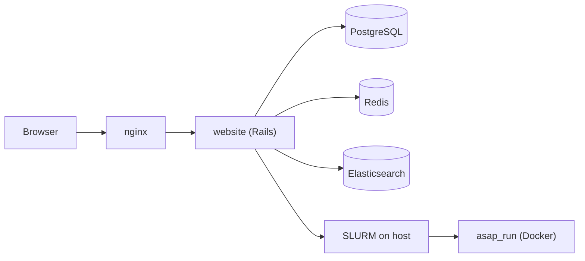

# ASAP — Automated Single-cell Analysis Pipeline

[ASAP](https://asap.epfl.ch) is a collaborative web platform for analyzing and visualizing single-cell RNA-seq (and related omics) data. It is developed at EPFL and listed among [SIB resources](https://www.sib.swiss/sib-resources).

This repository is the **next-generation web application**: a rewrite on **Rails 8** with **Tailwind CSS**, **Hotwire** (Turbo + Stimulus), and **Importmaps**, replacing the earlier stack while keeping compatibility with the existing analysis engine and data model.

> **Work in progress.** This branch is under active development and is **not ready for production** deployment without site-specific configuration, data, and operational setup.

---

## What you can do with ASAP

ASAP guides users through a modular analysis pipeline on large single-cell datasets (tested up to ~1.4 million cells). Typical steps include:

- Data import and parsing (plain text, archives, Loom, 10x HDF5, HCA projects, URL download)
- Cell and gene filtering, normalization, scaling
- Highly variable gene selection, dimension reduction, clustering
- Differential expression, gene-set enrichment, doublet calling
- Interactive UMAP/t-SNE visualization with metadata overlays
- Export of Loom result files and reproduction scripts for local re-runs

Each step exposes multiple methods; users are guided along the selected pipeline (single-cell transcriptomics or bulk transcriptomics) and can skip steps when appropriate. Registered users keep projects long-term; anonymous trial sessions use a sandbox that expires when the browser session ends.

---

## Technology stack

| Layer | Choices |
|-------|---------|
| Application | Ruby 3.4, Rails 8.1, Puma, Devise |
| Frontend | Tailwind CSS, Turbo, Stimulus, Importmaps, Propshaft |
| Data | PostgreSQL 15, Redis, Elasticsearch 8 |
| Background work | Solid Queue, Solid Cache, Solid Cable (Redis-backed) |
| Job execution | SLURM on the host + Docker-based analysis containers (`asap_run`) |
| Deployment | Docker Compose, nginx reverse proxy, Kamal (optional) |

Analysis workloads run in separate **asap_run** containers (built from `/srv/asap_run_new` on the deployment host). The Rails app submits jobs via SLURM, monitors completion, and stores outputs under configurable data directories.

---

## Architecture



**Docker Compose services** (`docker-compose.test.yml`):

| Service | Role |
|---------|------|
| `website` | Rails app (`src/` mounted at `/app`), SLURM client, Docker socket for job containers |
| `nginx` | TLS termination, large uploads, static `/data/` downloads |
| `postgres` | Primary application database |
| `redis` | Cache, Action Cable, Active Job |
| `elasticsearch` | Project and content search |
| `asap_run` | Long-lived analysis runtime image (Python/R/Java tooling) |
| `slurmdb` | MySQL accounting DB for SLURM (optional; SLURM daemons run on the host) |

Host bind mounts (paths vary by environment) provide user data, example datasets, SLURM/Munge sockets, and the `asap_run` build context.

---

## Repository layout

```
.
├── docker-compose.test.yml   # Main Compose file for local/test deployment
├── Dockerfile                # Rails application image
├── nginx.conf                # Reverse proxy and static file rules
├── src/                      # Rails application root
│   ├── app/                  # Controllers, models, views, services, Stimulus
│   ├── config/               # Routes, environments, scFAIR schema rules
│   ├── lib/                  # Analysis helpers, rake tasks, std-method sync
│   ├── public/swagger/       # OpenAPI spec for the REST API
│   ├── test/                 # Minitest suite
│   └── start.sh              # Container entrypoint (bundle, bin/dev or production)
├── slurm/                    # Example SLURM configs (*.example); site-specific copies are gitignored
├── scripts/                  # scFAIR extract parsers and maintenance utilities
└── script/                   # One-off setup helpers (e.g. public example data symlinks)
```

Notable in-app documentation:

- [`src/SLURM_SCHEDULER.md`](src/SLURM_SCHEDULER.md) — job submission, monitoring, rake tasks
- [`src/public/swagger/openapi.yaml`](src/public/swagger/openapi.yaml) — REST API (also at `/api_documentation` when running)

---

## Prerequisites

Before bringing up the stack you typically need:

1. **Docker** and **Docker Compose** on a Linux host with enough RAM and disk for PostgreSQL and analysis jobs.
2. **A PostgreSQL dump** of the ASAP reference schema and seed data (contact the maintainers or restore from your site's backup). Place init scripts under `startdb/` if using first-boot database seeding.
3. **Data directories** on the host (e.g. `/data/asap`) for uploads, Loom outputs, and user sandboxes.
4. **The asap_run image** — built from the companion repository [asap_run](https://github.com/DeplanckeLab/asap_run) at `/srv/asap_run_new` (see comments in `docker-compose.test.yml`). Rebuild after changing Python analysis scripts:
   ```bash
   docker compose -f docker-compose.test.yml build asap_run
   docker compose -f docker-compose.test.yml up -d asap_run
   ```
5. **SLURM** (optional but required for async pipeline runs in production-like setups): host `slurmctld` / `slurmd`, Munge key, and client config mounted into `website`. Start from `slurm/*.example`.
6. **Environment file** — create `.env` at the repo root (not committed). Use your team's template; variable groups include database URLs, Redis, Elasticsearch ports, `DATA_DIR` / `PROD_DATA_DIR`, `SERVER_URL`, SLURM/Munge paths, and Rails secrets.

---

## Getting started

### 1. Clone and configure

```bash
git clone <repository-url> asap2_test
cd asap2_test
cp /path/to/your/.env.template .env   # edit for your host
```

Set at minimum: `DATABASE_URL`, `POSTGRES_*`, `REDIS_*`, `DATA_DIR`, `SERVER_URL`, `SECRET_KEY_BASE`, and `COMPOSE_PROJECT_NAME` / `ASAP_RUN_DOCKER_NETWORK` so SLURM-started job containers can reach PostgreSQL on the Compose network.

### 2. Restore the database

Import your dump into the Postgres service (exact command depends on your dump format), or rely on `startdb/` init scripts on first container start.

### 3. Start services

```bash
docker compose -f docker-compose.test.yml up -d
```

The app listens on port **3001** (mapped to Puma's 3000). nginx exposes **8183** / **8184** when configured for HTTPS on your test hostname.

After changing `.env`, recreate the website container so Compose reloads variables:

```bash
docker compose -f docker-compose.test.yml up -d --force-recreate website
```

### 4. Run the SLURM scheduler loop (when SLURM is enabled)

Inside the website container or on a host with Rails and DB access:

```bash
docker compose -f docker-compose.test.yml exec website bundle exec rails slurm:start_scheduler
```

See [`src/SLURM_SCHEDULER.md`](src/SLURM_SCHEDULER.md) for one-shot tasks and monitoring.

---

## Development workflow

The `website` service mounts `./src` at `/app`. In development (`RAILS_ENV=development`), `start.sh` runs Foreman via `./bin/dev`, which starts:

- `bin/rails server` on `0.0.0.0:3000`
- `tailwindcss:watch` for CSS rebuilds

Common commands:

```bash
# Rails console
docker compose -f docker-compose.test.yml exec website bundle exec rails console

# Migrations
docker compose -f docker-compose.test.yml exec website bundle exec rails db:migrate

# Tests
docker compose -f docker-compose.test.yml exec website bundle exec rails test

# Tailwind build (production assets)
docker compose -f docker-compose.test.yml exec website bundle exec rails tailwindcss:build
```

---

## REST API

ASAP exposes JSON endpoints under `/api` for listing projects, fetching project exports, and related metadata. The OpenAPI 3 specification lives in [`src/public/swagger/openapi.yaml`](src/public/swagger/openapi.yaml). When the app is running, interactive documentation is available at `/api_documentation`.

Set `OPENAPI_SERVER_URL` in `.env` so the served spec points at your environment's API base URL.

---

## scFAIR compliance

The codebase includes validators and compliance reporting for [scFAIR](https://github.com/scFAIR/scFAIR_schema/blob/main/schema/7.1.0/README.md) (H5AD and Loom). Rules are driven from YAML under `src/config/scfair/`. Services under `src/app/services/scfair/` power the compliance UI and file checks.

---

## Testing

Tests use Rails' built-in Minitest framework under `src/test/`. Run the full suite or target a directory:

```bash
docker compose -f docker-compose.test.yml exec website bundle exec rails test
docker compose -f docker-compose.test.yml exec website bundle exec rails test test/services/scfair_compliance_service_field_values_test.rb
```

---

## Citing ASAP

If you use ASAP in published work, please cite:

- Gardeux V *et al.*, *Bioinformatics* 2017 — [doi:10.1093/bioinformatics/btx337](https://doi.org/10.1093/bioinformatics/btx337)
- David FPA *et al.*, *Nucleic Acids Research* 2020 — [doi:10.1093/nar/gkaa412](https://doi.org/10.1093/nar/gkaa412)

The running application also serves a [Citing ASAP](https://asap.epfl.ch/home/citing) page with additional references.

---

## Links

| Resource | URL |
|----------|-----|
| Production portal | https://asap.epfl.ch |
| asap_run Docker image | https://hub.docker.com/r/fabdavid/asap_run |

---

## Contact

Questions and feedback: use the in-app contact form or reach the team at **bioinfo.epfl@gmail.com**.

asap_web maintainer: Fabrice David — fabrice.david@epfl.ch
asap_run maintainer: Vincent Gardeux - vincent.gardeux@epfl.ch